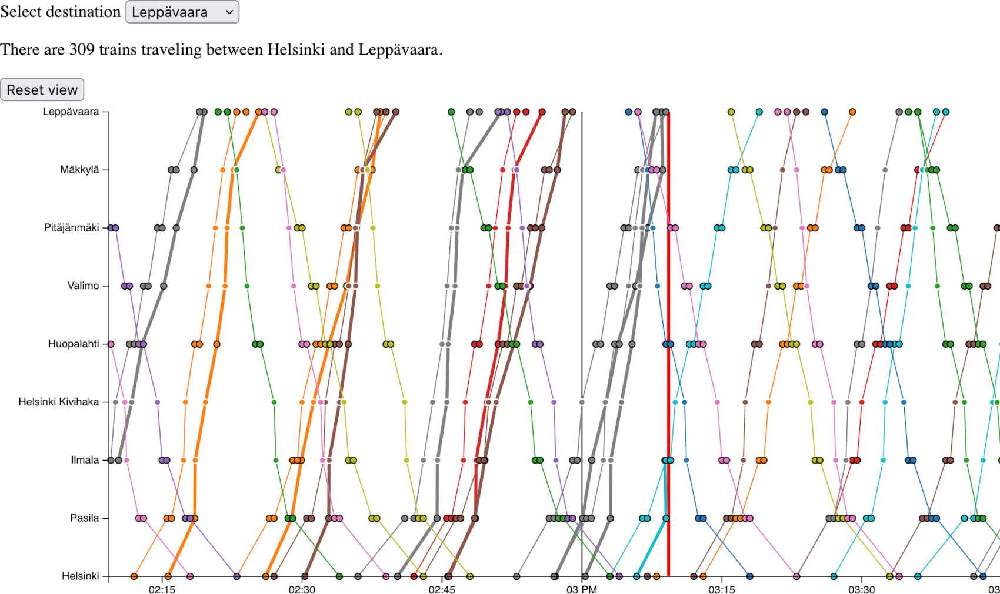

# Marey-Inspired Train Schedule Diagram

This project is hosted at http://train-diagram.herokuapp.com/.
The diagram has timeline on the x axis and stations on the y axis.
The thin lines on the diagram represent the estimated schedule of a
train and the bold lines represent the actual schedule.
The diagram can be dragged to move the time window on the x axis.
The red vertical line shows the current time on the diagram.
To reset the time window to the current time click the `reset view`-button.

## Running this project
This project was generated with [Angular CLI](https://github.com/angular/angular-cli).
This project is build using the [Angular](https://angular.io) front end framework
and an API of trains operating in Helsinki provided by [digitraffic.fi](https://www.digitraffic.fi/en/railway-traffic/).

### Development server

Run `ng serve` for a dev server. Navigate to `http://localhost:4200/`. The app will automatically reload if you change any of the source files.

### Build

Run `ng build` to build the project. The build artifacts will be stored in the `dist/` directory.

## Architecture
The data is downloaded and processed by `ScheduleComponent` which then
feeds to data to the diagram. The diagram is drawn the `TrainDiagramComponent`.
The train schedules are fetched using `ScheduleService`.
The `StationsService` gets the train station data, and
the `TrackingService` gets the train tracking data.
Any updates on the state are handled by the `UIService`.